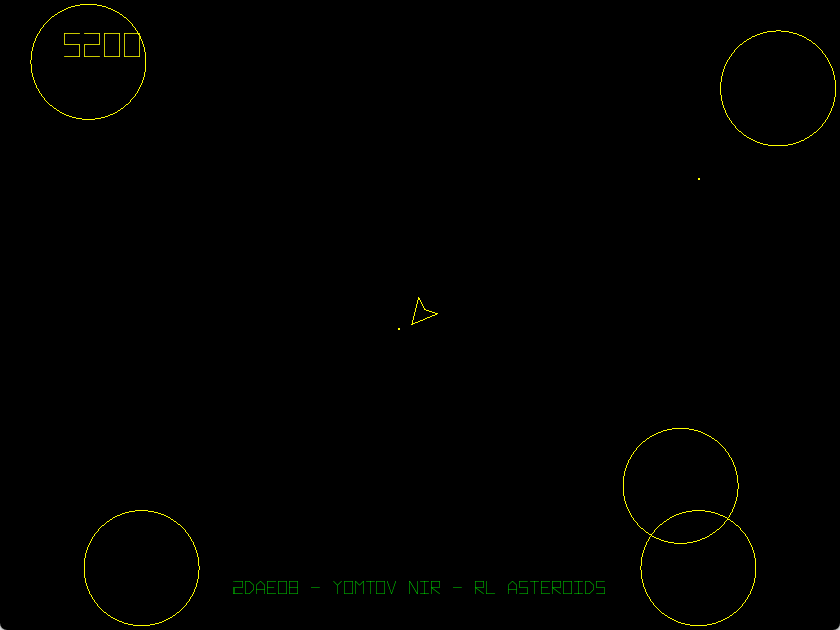
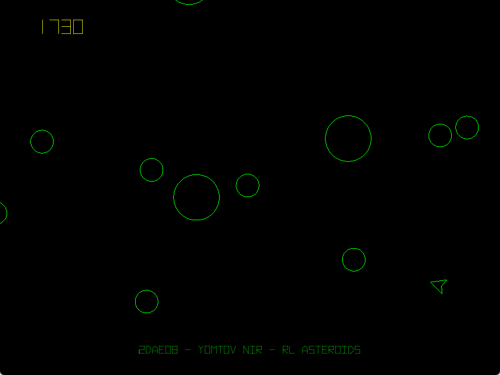

# RLNN_AsteroidsAI
Reinforcement Learning A.I that plays a clone of the classic arcade game of Asteroids.

Each agent uses a neural network with 9 input dimensions:
8 of which are for all directions around the agent in 45º increments, and one for determining if it can shoot.

The network has 16 dimensions in the hidden layer and 4 output dimensions that determine the agent's next action:

- Thrusting the spaceship
- Turning left
- Turning right
- Shooting

The activation function used in this project is the sigmoid function:
f(x) = 1 / (1 + e^(-x))

The current highest-scoring agent is colored in Gold, and its score is displayed at the top left corner of the screen.
After all agents are killed, the agent with the highest score is cloned and slightly mutated for the next generation.

#Showcase

Things start out pretty chaotically

After a few rounds an agent learns to shoot when an asteroid is in-front of it, and achieves the highest score

Move complex behaviours emerage, such as moving and shooting

Left for a few more rounds and an agent learns to only shoot when it can hit an asteroid with certainty

